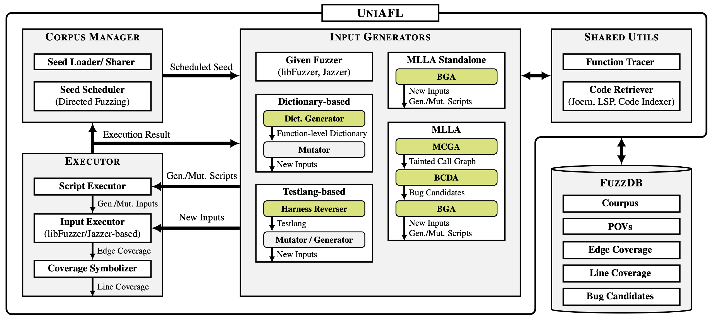

# CRS-multilang (w/o concolic)

## Quick Start

### 1. Get the target project

```bash
git clone git@github.com:google/oss-fuzz.git
```

- Verify the target exists at `oss-fuzz/projects/{target}`, **or** provide your own `{target}` directory in OSS-Fuzz format.
- The target Dockerfile **must** start with `FROM ghcr.io/aixcc-finals/base-builder:v1.3.0` — update it if necessary.

### 2. Clone the OSS-CRS repo

```bash
cd ~/
git clone git@github.com:sslab-gatech/oss-crs.git
cd ~/oss-crs
git checkout feat/refine-oss-crs
```

### 3. Prepare configuration

- Update values in `oss-crs/example-compose.yaml`
- Review `oss-crs/example-litellm-config.yaml`

### 4. Run prepare

```bash
# $REPO — root directory of this repo
cd ~/oss-crs
uv run crs-compose prepare \
  --compose-file $REPO/oss-crs/example-compose.yaml
```

### 5. Build target

```bash
# $REPO             — root directory of this repo
# $TARGET_PROJ_PATH — target project path, e.g., ~/oss-fuzz/projects/opensv
cd ~/oss-crs
uv run crs-compose build-target \
  --compose-file $REPO/oss-crs/example-compose.yaml \
  --target-proj-path $TARGET_PROJ_PATH
```

### 6. Run target

```bash
# $HARNESS_NAME — target harness name, e.g., fuzz_asn1_print
uv run crs-compose run \
  --compose-file $REPO/oss-crs/example-compose.yaml \
  --target-proj-path $TARGET_PROJ_PATH \
  --target-harness $HARNESS_NAME \
  --no-checkout
```

---

## Troubleshooting

### OSS-Fuzz Dockerfile Configuration

CRS-multilang is built on the AIxCC `base-builder:v1.3.0`. The target Dockerfile needs two small adjustments:

1. **Base image** — change to `ghcr.io/aixcc-finals/base-builder:v1.3.0`
2. **WORKDIR** — set to `$SRC/<project-name>` (e.g., `$SRC/mongoose`)

Example diff (mongoose project):

```diff
- FROM gcr.io/oss-fuzz-base/base-builder
+ FROM ghcr.io/aixcc-finals/base-builder:v1.3.0

- WORKDIR $SRC
+ WORKDIR $SRC/mongoose
```

> **Related issue:** [Team-Atlanta/aixcc-afc-atlantis#6 (comment)](https://github.com/Team-Atlanta/aixcc-afc-atlantis/issues/6#issuecomment-3514059044)

---

## Overview



| Component | Description |
|-----------|-------------|
| [UniAFL](./uniafl/) | Fuzzing infrastructure — [Core](./uniafl/src/msa/), [Corpus Manager](./uniafl/src/msa/scheduler.rs), [Executor](./uniafl/src/executor/), [Input Generators](./uniafl/src/input_gen/) |
| [FuzzDB](./fuzzdb/) | Database of fuzzing results |
| Dictionary-based | [Generator](./dictgen/) (LLM-inferred dictionaries) + [Mutator](./uniafl/src/input_gen/dict/) (function-level) |
| Concolic Executor | Omitted here — see [atlantis-multilang-snapshot](https://github.com/Team-Atlanta/atlantis-multilang-snapshot) |
| Testlang-based | [Reverser](./reverser/) (input format inference) + [Generator/Mutator](./uniafl/src/input_gen/testlang/) |
| [MLLA](./blob-gen/multilang-llm-agent/) | **M**ulti**L**ang-**L**lm-**A**gent — LLM-based input generator |

### MLLA Details

- **Standalone mode** — given a harness and target, uses the LLM to:
  1. Generate Python scripts that produce new inputs (blobs)
  2. Generate Python scripts that randomly produce inputs

- **Full mode** — given a harness and target, uses the LLM to:
  1. Analyze the target and build tainted call graphs
  2. Identify bug candidates from the call graphs
  3. Generate Python scripts that:
     - Produce blobs targeting the bug candidates
     - Randomly generate blobs targeting the bug candidates
     - Randomly mutate blobs to trigger the bug candidates

---

## Authors

**CRS-multilang Team @ Team Atlanta**

| Name | Area |
|------|------|
| HyungSeok Han | Lead, Integration, UniAFL |
| Jiho Kim | UniAFL, Benchmarks |
| Woosun Song | Concolic Executor |
| Dae R. Jung | Dictionary-based |
| Kangsu Kim | Testlang-based |
| Dohyeok Kim | Testlang-based |
| Eunsoo Kim | Testlang-based |
| Soyeon Park | MLLA |
| Dongkwan Kim | MLLA |
| Sangwoo Ji | MLLA |
| Joshua Wang | MLLA |
